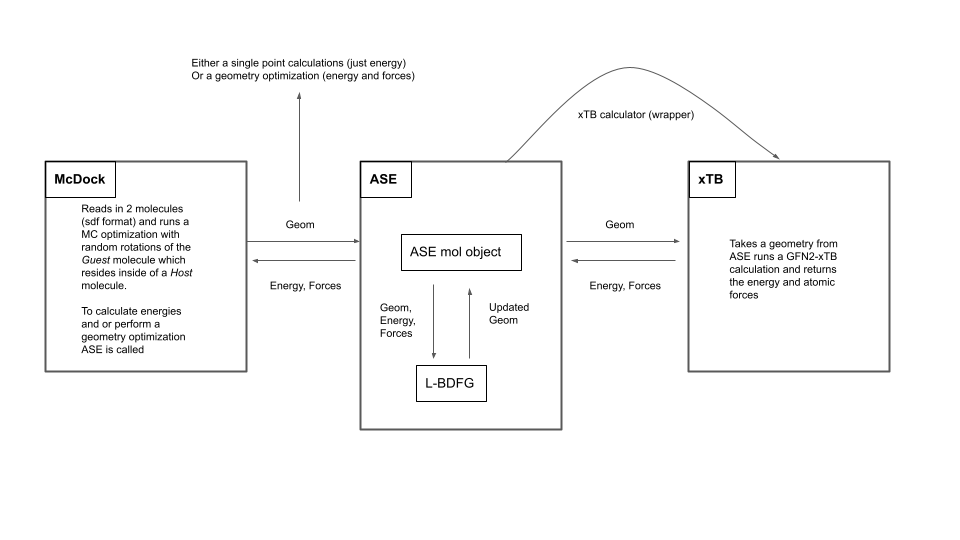

# rdkitMcDock

This code takes a `Host` molecule and a `Guest` molecule, reads them in, optimizes the geometries, merge them into the same `system`, moves both to the origin, and then performs
an MC simulation by rotating the `Guest` molecule and optimizing (L-BFGS) both geometries using ASE and the xTB calculator.

## Installation:
Conda needs to be installed on your system. Then:

- create a conda environment (here it's called McDock)
- activate the environment
- install requirements (RdKit, ASE, xTB, numpy)
- xyz2mol needs to be installed from source (from github)

copy paste the commands after the $ sign to your terminal

```
(base)   $ conda create -name McDock
(base)   $ conda activate McDock
(McDOck) $ conda install -c anaconda numpy
(McDock) $ conda install -c conda-forge xtb
(McDOck) $ conda install -c conda-forge ase
(McDock) $ conda install -c rdkit rdki
```
To install xyz2mol clone the git repository:
```
git clone https://github.com/jensengroup/xyz2mol
```
cd into the directory and type `make`
```
cd xyz2mol
make
```
This path is hardcoded wherever you install it. To run McDock you need to change line 157 in utils_rdkit.py to the path where you isntalled xyz2mol
```
157     cmd = "python ~/workcopies/xyz2mol/xyz2mol.py run_min.xyz -o sdf > run_min.sdf"
```
change `~/workcopies/` to the path where you isntalled it!

## Run mcDock
Before running you need to change the memory default options of xTB using following command in your cmd line and also make a directory called directory:
```
ulimit -s unlimited
mkdir directory
```
Then you can run mcDock using following command:
```
./mcDock_rdkit.py --ligand small_conformer.sdf --target PA_hexamer.sdf  --forceField UFF --trajectories 3 --steps 15 --temperature 0.3
```
forcefield is obsolete but at the moment necessary...

## mcDock Workflow

